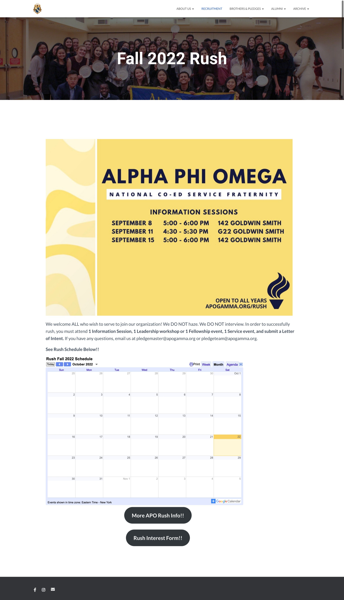
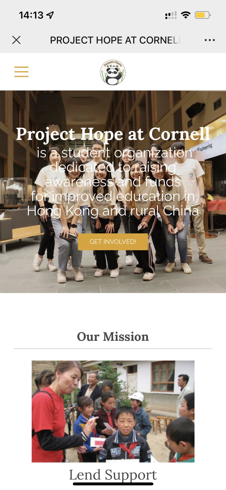
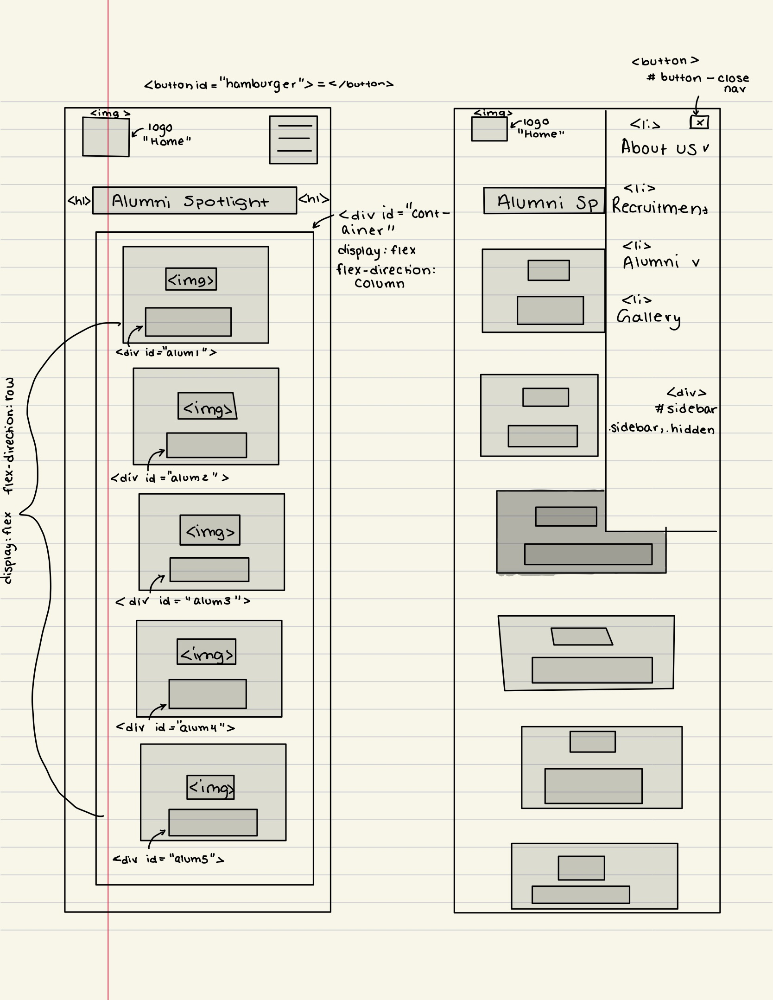

# Group Project: Design Journey

**For each milestone, complete only the sections that are labeled with that milestone.** Refine all sections before the final submission.

You are graded on your design process. If you later need to update your plan, **do not delete the original plan, leave it in place and append your new plan _below_ the original.** Then explain why you are changing your plan. Any time you update your plan, you're documenting your design process!

**Replace ALL _TODOs_ with your work.** (There should be no TODOs in the final submission.)

Be clear and concise in your writing. Bullets points are encouraged.

**Everything, including images, must be visible in _Markdown: Open Preview_.** If it's not visible in the Markdown preview, then we can't grade it. We also can't give you partial credit either. **Please make sure your design journey should is easy to read for the grader;** in Markdown preview the question _and_ answer should have a blank line between them.

## Client (Milestone 1)

### Client Description (Milestone 1)

> Tell us about your client. Who is your client?
> Explain why your client meets the client rules in the project requirements.

Our client is Alpha Phi Omega Gamma Chapter at Cornell University (APO). This client meets the client rules in the project requirements because it is a service organization on campus and is currently looking to update its Cornell Chapter website. After communication, our client understands that their goals could be accomplished by a static website and hence decided to remove the page that is password protected. Hence, our client fits the project requirement as they are looking to update a static website. None of the group members have a direct, personal connection to the organization hence none of the team members would be our client.

### Client Questionnaire (Milestone 1)

> Develop a client questionnaire to learn more about your client and their goals.
> You may use the questionnaire below, you may modify the questionnaire below, or you may create your own.

1. Describe your organization and its purpose.

2. What makes your organization and its services special or unique?

3. Why are you looking for a new website or updating your existing site?

4. Who do you want to visit your site? Who do you believe is your website's intended audience?

5. When visiting your site, what actions do you want your visitors to take?

6. What are your goals for this site?

7. Is there a "feel" that you want for your site? Are there colors or imagery that you have in mind?

8. What are your three favorite competitors or similar organizations' websites? Why?

### First Client Meeting Minutes/Notes (Milestone 1)

> Include your notes/minutes from your first meeting with your client.

1. Describe your organization and its purpose.

   - APO Gamma Chapter is a co-ed service fraternity, but I think of it more as an organization. We're one of the biggest service orgs on campus.
   - We're not really selective, anyone can rush and participate in a wide variety of service events and attend leadership workshops
   - Meet a lot of people from all majors and backgrounds

2. What makes your organization and its services special or unique?

   - (One of) the biggest service orgs on campus
   - We're structured like a fraternity, so we have a first semester where rushees must complete certain
   - Pledeges must separate into teams tow ork on a pledge group project together -> a way for them to get close with their pledge class and group leader
   - In that first semester, they can meet eboard and other people in the fraternity
   - Unlike other orgs where everyone starts on an equal footing
   - Rushees and pledges have to do a bit more and get to know their PC and eboard better before joining the frat officially and going to whatever events they want.

3. Why are you looking for a new website or updating your existing site?

   - Issue with current site: outdated information, look is not aesthetically pleasing
   - Purpose: for people to learn more about APO, but not necessarily all the events we have
   - We have a separate site that's not run by our chapter specifically (by the national org)
     - I do think it would be better to incorporate what events we have
     - Only people who joined and rushed have access to the national org website
     - The outdated website doesn't feature upcoming and all events -> I want this to change for non-brothers to see what we're about and what we have (other than just pictures)
   - But still an important event, for people who haven't joined yet and want to look
   - A lot of the material is inaccessible?
   - Website just looks like words and links, no layouts
   - Want the website you redesign for us to be for people who are non brothers and might be interested in joining APO
   - Generally, when recruiting, we feel that the outdated website lacks -> there are people who are in support of having more current events on the public website.

4. Who do you want to visit your site? Who do you believe is your website's intended audience?

   - People who haven't joined APO yet and are interested in it (Rushees)

5. When visiting your site, what actions do you want your visitors to take?

   - For non-APO members, I want them to be able to easily find out what happens during rush (expectations, requirements)
   - Find information on how to officially join and become a pledge

6. What are your goals for this site?

   - Non-brothers & pledges, so they can get a good idea of what our chapter does
   - We also want current brothers to find it useful for meeting minutes and to be more motivated to update it
     - An open space for active members to record what's happening in the org
   - Want the website to look more aesthetically pleasing and make it easier to find where everything is (accessible & useful), having a reasoning behind why content is there and where it is

7. Is there a "feel" that you want for your site? Are there colors or imagery that you have in mind?

   - APO's colors are gold and navy (but the gold is not very pretty)
   - It's important to maintain the color scheme, but I feel like we can somewhat branch out
     - Maybe keep the colors on the home page, but on the other pages we should have some more creative freedom because we're not the national website

8. What are your three favorite competitors or similar organizations' websites? Why?

   - A lot of the other clubs might not have a national website, they do a lot of outreach via social media or campus groups
   - National Red Cross
   - Key Club

- Rushing: figuring out if you want to join
- Pledging: when you complete a certain number of required events and writing a letter of intent

### Client Website (Milestone 1)

> Tell us about the website that your client wants.
> Tell us the purpose of the website and what it is all about.
> Note: **If you are redesigning an existing website, give us the current URL and some screenshots of the current site.** (FireFox makes it easy to take a full screenshot of a page from the context menu (right click).)
> If you are redesigning an existing site, tell us how you plan to update the site in a significant way that meets the project's requirements.

Our client hopes to update the website for APO Cornell Chapter so that it would be more usable. Currently, no one knows about or visits the website nor is it updated frequently. They want to make the website a resource for all Cornell students who are interested in joining APO. The potential rushees could visit the website to learn about what APO does and what the vibe within the group is like. Because the website aims to appeal to potential rushees, our client hopes the website could be aesthetically pleasing and all the content could be easily accessible to the potential rushees.

Current URL: http://www.apogamma.org

<!-- Source: http://www.apogamma.org/ -->


<!-- Source: http://www.apogamma.org/eb/eb-fa22/ -->


<!-- Source: http://www.apogamma.org/rush/ -->



<!-- Source: http://www.apogamma.org/alumni-spotlights/ -->


We plan to update the site so that it contains more accessible information regarding the organization, how to join, and who its members are (the community)--this is information that rushees and potential rushees are looking for. The current website contains password protected pages that current brothers (active members) have access to -- because the website we're building will be static, we plan to get rid of this section such that the website's main target audience is people who are interested in joining.

### Client Goals (Milestone 1)

> Identify your client's goals for the website.
> What kind of website do they want? What are their goals for the site?
> There is no required number of goals. You need as many goals as necessary to reflect your client's desires.

- Goal 1: The client wants us to publicize their goals and intentions overall in APO
- Goal 2: The client wants to let incoming rush members know exactly what happens during the rush process
- Goal 3: The client wants the website to look more aesthetically pleasing and more welcoming to new possible members
- Goal 4: The clients wants the website to be more appealing to new members also

### Client Website Scope (Milestone 1)

> We want your project to be successful! It needs to be ambitious, but not too large.
> A good rule-of-thumb is that you should have about 1 content-full page for each team member.
> Explain why the website you will create for your client isn't too small and isn't too big.
> Explain why you think it's the right size for this project.

This website is the right size for this project because everybody got at least one content-full page to work on. Based on the content organization of the previous website (mainly the navigation bar), because our static website will not concern the "Brothers & Pledges" page which needs a password, we will assign each member to one page ("About Us", "Recruitment", "Alumni", "Archive").

It's not too small because it contains all the necessary content that hits every goal of the client, and it isn't too big for us to code content for as each member is expected to contribute 6 hours to this project weekly.

## Plan/Schedule (Milestone 1)

> Make a plan of when you will complete all parts of this assignment.
> This plan is for your team. There is no required format. Format it so that it works for you!
> Your plan should include when you will interview users and analyze their goals.
> Your plan should also include how and when you will assemble/create the sit's content.
> **Tip:** Your team should plan to work ahead. This project really isn't feasible to complete the night before a deadline.

We will meet Saturdays, Mondays, and Tuesdays weekly in person to work on the project. If anyone has free time and wants to work on it, they will let the group chat know and everyone should remember to pull.

- Milestone 2:
  - Have it (mostly) done on Tuesday, 11/15, go to office hours if we have to, and then submit a rough draft.
  - On Wednesday, 11/16, Amy will submit the finalized version.
  - When we do example websites, each person will pick a website (not too similar) and write about it in the design journey.
  - User Interview Process:
    - We all come up questions
    - Inform the group of who you want to interview and a quick overview about who they are, before interviewing them
    - Interview them and update notes on your own time and put it in design journey -- ALWAYS PULL BEFORE STARTING ANY WORK
  - When we do card sorting, we will do it in person and each put our own ideas of card sorting.
- Final Submission: We hope to have everything done including user testing before Thanksgiving break, and after that will do any revisions that need to made and submit on Wednesday, 11/30.

## Understanding Users (Milestone 2)

**Make the case for your decisions using concepts from class, as well as other design principles, theories, examples, and cases from outside of class.**

You can use bullet points and lists, or full paragraphs, or a combo, whichever is appropriate. The writing should be solid draft quality, but it doesn't have to be fancy.

### User Interview Questions (Milestone 2)

> Plan the user interview which you'll use to identify the goals of your site's audience.
> You may use the interview template below and revise it as much as you desire.

**User Interview Briefing & Consent:** "Hi, I am a student at Cornell University. I'm currently taking a class on web design and for a project, I am designing the website for the Alpha Pi Omega Gamma Chapter, a national service fraternity. I'm trying to learn more about the people that might use this site. May I ask you a few questions? It will take about 10 minutes. You are free to quit at any time."

1. Please tell me a bit about yourself. You may omit any personal or private information.

2. What clubs have you joined at Cornell so far and how did you find out about them?

3. What did you specifically look for when you seeking out information about the clubs? Was there any information you were looking for that was hard to find?

4. Do any of these clubs have a website? If so, did you visit it and what information did you find about it was valuable?

5. If any of these club that had a recruiting process, what difficulties (if any) did you encounter during this recruitment season (not new member education)?

6. If you had a question regarding recruitment or joining the club, would you know who to contact? If so, how? If not, how would you go about contacting someone?

n. What haven't I asked you today that you think would be valuable for me to know?

**After the interview:** "This was really helpful. Thank you so much for agreeing to speak with me today. Have a great day!"

### Interview Notes (Milestone 2)

> Interview at least 1 person for every member of your team from your audience.
> Take notes and include those notes here. Make sure to include a brief description of each interviewee.
> **Copy the interview questions above into each interviewee section below.**
> Take notes for each participant inline with the questions.

**Interviewee 1:**

1. Please tell me a bit about yourself. You may omit any personal or private information. \
   My name is Gina and I’m a junior student studying Psychology and Sociology.

2. What clubs have you joined at Cornell so far and how did you find out about them? \
   CURB, Rho Psi, Psi Chi, APO, Smart is Strong Foundation.
   I found out about them mostly from clubfest or from friends who were already in these clubs.

3. What did you specifically look for when you seeking out information about the clubs? Was there any information you were looking for that was hard to find? \
   I’m very passionate about doing research and volunteering, so those are definitely the keywords when I start looking for joining clubs. I also relied on Instagram and Facebook a lot because they tend to post most of their information on social media.

4. Do any of these clubs have a website? If so, did you visit it and what information did you find about it was valuable? \
   I don't know if this counts but most of them have an Instagram page. They post information about recruitment and event details so it’s very easy to find. I checked a few websites but I found that Instagram pages were more up to date so I just used them.

5. If any of these club that had a recruiting process, what difficulties (if any) did you encounter during this recruitment season (not new member education)? \
   I think it’s mostly about where events take place. For example, when I was rushing for APO, the website said that one of the mandatory info session would take place at GSH, but they changed the location and the website wasn’t updated, so I had to end up emailing people on the eboard for details.

6. If you had a question regarding recruitment or joining the club, would you know who to contact? If so, how? If not, how would you go about contacting someone? \
   The website mostly contains information about people on the eboard, including recruitment chair, so I would just reach out to them.

**Interviewee 2:**

1. Please tell me a bit about yourself. You may omit any personal or private information. \
   My name is Corvyn Register and I'm a freshman in the engineering school.

2. What clubs have you joined at Cornell so far and how did you find out about them? \
   URMC, HSP
   I found out about them at the cllub fair and through friends.

3. What did you specifically look for when you seeking out information about the clubs? Was there any information you were looking for that was hard to find? \
   I look for social or networking events, more information about the recruitment process, and depending on the club, I look for coffee chats. It was hard to find contact information other than an email occassionally.

4. Do any of these clubs have a website? If so, did you visit it and what information did you find about it was valuable? \
   They do technically have websites, but they're not very helpful.

5. If any of these club that had a recruiting process, what difficulties (if any) did you encounter during this recruitment season (not new member education)? \
   During the recruitment process for many of the business clubs, it was hard to find what we needed to know and what the clubs were looking for from us during our interviews, and when talking to current club members.

6. If you had a question regarding recruitment or joining the club, would you know who to contact? If so, how? If not, how would you go about contacting someone? \
   Yes, to the official club's email address or to the person incharge of recruitment.

n. What haven't I asked you today that you think would be valuable for me to know? \
N/A

**Interviewee 3:**

1. Please tell me a bit about yourself. You may omit any personal or private information. \
   My name is Grace and I'm a freshman studying AEM in Dyson. I'm from NYC.

2. What clubs have you joined at Cornell so far and how did you find out about them? \
   I joined KASA, which I found out about from friends who are current students and in the club. Also found out more about them through their Instagram account and Club Fest.
   I also tried applying to business clubs and organizations like GCC and PCT, which I found out about through a Dyson-specific club event.

3. What did you specifically look for when you seeking out information about the clubs? Was there any information you were looking for that was hard to find? \
   For social clubs like KASA, I usually look at what events they have, when and where they are. I also like to see who the E-board members are. For more professional clubs, I look at information about their recruitment process (like how to apply), details about their recruitment events, and how the club could benefit me (the alumni network, networking events they have, sponsors, etc).
   I think it's hard to find ways to talk to the members of these clubs aside from going to their events in person. I feel like it's kinda awkward if I just stalk the Instagram pages to find the members and request fo follow them.

4. Do any of these clubs have a website? If so, did you visit it and what information did you find about it was valuable? \
   I visited GCC and PCT's websites. They obviously had information about the rush or recruitment process and it was helpful to see resources for recruitment (interview tips, resume, coffee chat links, etc). Their E-board and member pages were also valuable because everyone had a small blurb about themselves, with their email there too.

5. If any of these club that had a recruiting process, what difficulties (if any) did you encounter during this recruitment season (not new member education)? \
   PCT had a lot of resources on recruitment and tips for interviews, but GCC didn't really have that. They had a rush timeline with the location and date of the events, but nothing much on the website about how to succeed in recruitment.

6. If you had a question regarding recruitment or joining the club, would you know who to contact? If so, how? If not, how would you go about contacting someone? \
   Yes, they have their email on their websites and also have a Connect page.

n. What haven't I asked you today that you think would be valuable for me to know? \
N/A

**Interviewee 4:**

1. Please tell me a bit about yourself. You may omit any personal or private information. \
   My name is [redacted] (did not want her name included). I am a junior studying biology.

1. What clubs have you joined at Cornell so far and how did you find out about them? \
   I joined building ourselves through sisterhood and service , phi delta epsilon, and BOSS. I found out about them through word of mouth. I had friends in BOSS, so that is why I joined them. In addition, Phi delta epslion is the pre-professional frat for medicine, so I already knew about them.

1. What did you specifically look for when you seeking out information about the clubs? Was there any information you were looking for that was hard to find? \
   I struggled with finding information to join the club. But because I knew people in BOSS I was able to find out. I went to Phi De's website to find information on how to join, but they did not update their website. However,I just went to their instagram page and found everything I needed.

1. Do any of these clubs have a website? If so, did you visit it and what information did you find about it was valuable? \
   Wanted to know their purpose, mission statement, and how can members help out the club

1. If any of these club that had a recruiting process, what difficulties (if any) did you encounter during this recruitment season (not new member education)? \
   There was not enough information about what you can and cannot do during recruitment. There was also not enough information about the final interview, so because I had never interviewed for a pre-professional club before I was very in the dark about what was going on. In the future, I would want more clarity about the recruitment process.

1. If you had a question regarding recruitment or joining the club, would you know who to contact? If so, how? If not, how would you go about contacting someone? \
   There is a point of contact that is established once the recruitment process starts. They are usually the ones that email you. However, I was scared to reach out to them because I did not know if that would affect my application, so saying a piece about that would be very helpful. Phi De did have recruitment buddies that were very responsive.

n. What haven't I asked you today that you think would be valuable for me to know? \
I think emphasizing the requirements needed to stay in a club is really important. In addition, highlighting the oppurtunitites to connect with other members is also really important.

### Goals (Milestone 2)

> Analyze your audience's goals from your notes above.
> List each goal below. There is no specific number of goals required for this, but you need enough to do the job (Hint: It's more than 1 and probably more than 2).

Goal 1: Provide updated information about recruitment or rushing process

- **Design Ideas and Choices** _How will you meet those goals in your design?_
  - page dedicated to recruitment
  - a clear schedule of important dates and times for recruitment
  - the schedule might be designed in a vertical timeline format so that the user could easily look for specific dates
- **Rationale & Additional Notes** _Justify your decisions; additional notes._
  - These design ideas and choices provide the reader with necessary information that they may need for trying to join the club. This is because each design idea targets an aspect of information that is useful to the user.

Goal 2: Provide information about social events that can be used for networking

- **Design Ideas and Choices** _How will you meet those goals in your design?_
  - a gallery page for images of social events
  - dates of social events
  - location of the event
- **Rationale & Additional Notes** _Justify your decisions; additional notes._
  - These design ideas and choices support the goal because they each target an aspect of social events that users may need to know. Having the dates front and center with the social events makes it easier for the user to go to those events and network. In addition, one user mentioned that the location was something that they had trouble finding, so having an updated version of the location on the website is helpful. Finally, having images gives the user insight into what the social events are like and will make them more likely to attend future events.

Goal 3: Provide methods to reach out to members of the club

- **Design Ideas and Choices**
  - Contact page with emails of specific leaders within the club (ex: President, Recruitment Chair, etc)
  - On Executive Board page, have a pop-up modal for each member that opens up to their introduction statement and ways to contact them (email, Linkedin). This modal appears after you click on their headshot.
- **Rationale and Additional Notes**
  - These design ideas provide the user with necessary contact information. We decided to only focus on putting contact information for leaders in the organization, because they are the most direct sources of information regarding the club. The pop-up modal is a good idea because having the email and other contact in addition to the member introduction can make the webpage look crowded: adding interactivity and hiding this information until users click on a headshot therefore makes the website more visually pleasing.

### Audience (Milestone 2)

> Briefly explain your site's audience.
> Be specific and justify why this audience is a **cohesive** group with regard to your website.

The audience of our website is Cornell undergraduate students who are interested in finding service opportunities. Since APO has a separate website for offical members and pledging members, the website we are building is specifically for people who have not joined APO yet, and hence we conclude our audience. This is a cohesive group of audience as they all belong to the Cornell undergraduate community and they share an interest in participating in community services. And this group of people share the goals of hoping learning more about rushing information, APO events and finding ways to reach out to current members.

## Website Design Exploration (Milestone 2)

Identify three websites (preferably static websites) that exist today on the web to draw inspiration from. Please select websites that are similar to the website you wish to create.

Include two screenshots of the home page for each site: narrow and wide.

**We'll refer to these are your "example websites."**

1. <http://projecthopecornell.weebly.com/>

   

   

2. <https://www.cornellfinancialanalysts.com/>

   

   

3. <https://www.gcccornell.com/>

   

   

### Example Website 1 Review (Milestone 2)

> Review the website you identified above. (1 paragraph)
> In your review, include a discussion common design patterns and interactivity in the site.

The website uses a common design pattern on the home page to improve the page's usability so that the audience would stay on the website. The logo is big and centered, and no heading is needed because the text in the logo entails everything.
Below the logo is the navigation bar with clear organization. The navigation bar applies the interactivity of a drop-down menu. When the mouse hovers over to the “about us” or “events” sections, a drop-down will display the subsections. In doing so, the content on each page is kept to readable length and the audience could navigate to the topic they hope to learn about quicker with the help of detailedly divided subsections. \
Because this club involves a lot of activity planning and socials, a lot of photos are used to elaborate the content. In fact, there is a section called “photos” dedicated to demonstrating the club’s vibe and duties through imagery. On this page, photos are organized in different event albums, and all the event albums are listed as a gallery. When the audience clicks on an album, they could check all the photos of that event in gallery mode or they could click on the photo to view an enlarged version through a pop-up modal. This is a common design pattern as the audience would know that the photo gallery is clickable when they hover and expect a modal after clicking. Furthermore, to manage this large number of photos, for every page that contains multiple photos, a carousel with thumbnails is applied so that the audience could quickly scan through all the photos on the page and skip to any photo using the thumbnails. This familiar design pattern is very commonly seen as most of the websites needing to display various photos use this design as it allows the audience to see the details of a photo and get an idea of the overview of the entire photo collection at the same time. \
The website also includes a form on the “contact” page collecting a list of interests and feedback. This is also a common design pattern because the form is very widely used in organization websites. It is an efficient way to collect information about visitors of the site and the rectangle input boxes are pretty self-explanatory.

### Example Website 2 Review (Milestone 2)

> Review the website you identified above. (1 paragraph)
> In your review, include a discussion common design patterns and interactivity in the site.

The home page of the website greets its user with a photo with skyscapers that also says "Cornell Financial Analysts" in a professional font that is consistent accross different platforms. Both show their logo of a bull and also use dullish-blue and white as a theme. The website most likely uses these colors and the picutre of facing up to the skyscrapers to give the user the feeling of wallstreet, time square, or another place that is well-known for trade and success. The navigation bar contains a home page, an about page, a recruitment page, a members page, a note from our cofounder page, and a more page. On the home page, there is also a large "APPLY NOW" button as well as a contact us portion where the user can submit their name, email, and send a message to the club.

Even though the webiste offers all of these things first glance, it ends up being a lot for the user to be suddenly introduced to, and it could contain more welcoming content such as a photo of the members in the club together or something else similar that would convey a welcoming feeling. Additionally, even though the website provides many navigation bars, it would most likely be better if they condensed their content because there is a lot of information to absorb in the navigation bar. Additionally, there could be better imagery in the recruitment schedule because it appears cluttered and ueses too much space with an unappealing text-to-background contrast. However, the website generally uses a familiar design, could use more imagery, but generally provides helpful content to its user.

### Example Website 3 Review (Milestone 2)

> Review the website you identified above. (1 paragraph)
> In your review, include a discussion common design patterns and interactivity in the site.

This website contains a large hero image (GIF) of a city skyline with text saying "GCC Cornell University Chapter" on top of it. Although the hero image contributes to the urban and entrepreuerial aspect of the organization, it takes up a lot of space. For the navigation, the logo is on the left side of the page, and there are 7 pages to select (not including the Login page, which APO similarly has, but we will not be including). The pages are: Home, About, Members, Recruitment, Alumni, Connect, and Apply. These pages provide a lot of information about what the club is, who some of its members are, and how to join it. In particular, the Recruitment page includes a well-spaced out, easy to read, and visually pleasing timeline of the recruitment season. For example, for Coffee Chat events, the dates are bolded and in larger text, and there's a link to register for one right under the date. The Apply buttons are found throughout the website (ex: navigation, at the bottom of the Recruitment page), but I feel that they can be made more visible. The Apply Now button can be moved to the top of the Recruitment page (but below the images), and on the navigation bar, adding a border around it rather than underlining it would make it stand out more as a call to action. Another important part of an organization is its values and mission, which GCC does a good job of communicating under its About page. One part of the webpage that stands out is the section "Our Values". Under this heading, there are 3 boxes with the words "Mentorship", "Professional Excellence", and "Inclusivity" on each, but when you hover over them, the words are replaced by blurbs that explain how the organization exemplifies these values. This is a good way of adding interactivity and making efficient use of the website's space and information.

## Content Planning (Milestone 2)

Plan your site's content.

### Your Site's Planned Content (Milestone 2)

> List **all** the content you plan to include your website.
> You should list all types of content you planned to include (i.e. text, photos, images, etc.)

- [Text Content](text-content.md)
- image of all the brothers in the fraternity
- logo of fraternity
- text about the fraternity
- text and numbers detailing achievements (x service hours, x active brothers, x dollars raised)
- information about the pillars (leadership,friendship, and service)
- Join our Chapter (Heading)
- Rush Information Session Image
- images of recruitment events
- images of social events or volunteering activities
- dates of alumni events
- text detailing location of events
- logos of partners
- timeline of recruitment with dates and times
- button linking to Rush Interest Form
- text about alumni
- Image of all brothers (family)
- Families (7)
  - Family Banner Images
  - Family Blurb
  - Button to their Instagram
  - Fam Member Headshots
- Philanthropy
- Text about Nate Rand
- Image of Nate Rand
- Past event images for Philanthropy
- Philanthropy event blurbs

### Content Justification (Milestone 2)

> Explain (about a paragraph) why this content is the right content for your site's audience and how the content addresses their goals.

This content is right for the site's audience for a few reasons. The timeline of recruitment fulfills goal 1 of the audience as it provides essential information for the recruitment process. The information of members, families, and events address goal 2 and 3 as they inform the audience about the people in APO. The images that are included such as the brothers of the fraternity, recruitment, and social events all provide insight into the fraternity that text cannot typically provide. In addiiton, the images make the website more personable by having members of the fraternity.

## Information Architecture (Milestone 2)

### Content Organization (Milestone 2)

> Document your **iterations** of card sorting here. You must have at least 2 iterations of card sorting.
> Include photographic evidence of each iteration of card sorting **and** description of your thought process for each iteration.
> Please physically sort cards; please don't try and do this digitally.

#### Iteration 1


<!--Source: (original work) Brown-Cheetah Group-->

For this iteration, we grouped the content based on its topic and made each topic into a page. So we ended up with six pages: "Home", E-Board", "Philantrophy", "Family", "Recruitment", and "Alumni". This sorting is very straightforward.

#### Iteration 2


<!--Source: (original work) Brown-Cheetah Group-->

In this iteration, we tried to add subsections under the main navigation by putting the E-Board and Family content together under "People". The subsections could elaborate on the content better.

#### Iteration 3


<!--Source: (original work) Brown-Cheetah Group-->

This iteration enhances the idea of subsections under broad topics. We divided the content into four main sections: "About Us", "Recruitment", "Alumni", and "Gallery". Under "About Us", we included the E-Board, Partners, Family, and Philantrophy content. This organization is more precise for in terms of navigation as it has different degrees of organization.

### Final Content Organization (Milestone 2)

> Which iteration of card sorting will you use for your website?

We are using the third iteration of card sorting.

> Explain how the final organization of content is appropriate for your site's audiences.

This organization makes sense for the audience because we divided the content into 4 big sections: about us, recruitment, alumni, and gallery. Everything else (the content) is a sub-section where the content all relate to eachother. This makes it more convenient for the audience because it organizes the content in a more efficient manner. In addition, the audience is not overwhelmed by the amount of content that is there because of how it is organized.

### Navigation (Milestone 2)

> Please list the pages you will include in your website's navigation.

- Home (Click on the logo brings to Home page)
- About
  - Executive Board
  - Families
  - Philanthrophy
  - Our Partners
- Recruitment
- Alumni
  - Alumni Spotlights
  - Upcoming events
- Gallery

> Explain why the names of these pages make sense for your site's audience.

These page names make sense for the site's audience because they each target a different pathway of information that is useful to the audience. Specifically, the about page provides information to the user who wants to learn more about the club. The recruitment page is important for the audience's goals because it groups content pertaining to recruitment together. Given that finding information about recruitment is a goal for the audience, this page is useful for the user. There is the alumni page for users who wish to learn more about past members and also the possible events that are available. The final page is gallery which includes images of members, socials and past events. This makes sense for the site's audience because it gives the user visual insight into the fraternity and what they may encounter.

## Visual Theme (Milestone 2)

> Discuss several (more than two) ideas about styling your site's theme. Explain why the theme ideas are appropriate for your target audiences. Note the theme you selected for your site and why it's appropriate for the audience and their goals.

**Styling 1** \
The first theme is friendly and happy. This fraternity has "families" so having a sense of friendliness draws the audience into the website and makes them more likely to attend the events that are listed on the website. In addition, having "families" as the foundation of the club creates a sense of community that the website should convey. These address the goals of the audience because a large portion of them are trying to find out more information about the club, so having this theme makes it less intimidating for them to achieve their goals.

**Styling 2** \
Having a APO(yellow and blue) theme is also a possible theme that could be used to style the website. These colors represent the color of the fraternity so having their colors as a theme shows spirit and again invites the audience to look at the website. The goals of the audience are to find more information about the fraternity and give information that is important to recruitment. Having the colors as the theme is another piece of information that the audience member will learn about it.

**Styling 3** \
The final theme that we chose is professional because it best fits the purpose of this site and the audience's goals. This is because the fraternity is trying to recruit members but also maintain a sense of professionalism because they have real-world partners and alumni that represent them. In addition, the audience is trying to find out more information about the club and having a theme that accurately reflects the fraternity is important. Therefore, professionalism is the best theme and that is the theme we chose for the design of the website.

## Design (Milestone 2)

Document your site's layout.

## Interactivity Brainstorm (Milestone 2)

> Using the audience goals you identified, brainstorm possible options for interactivity to enhance the functionality of the site while also assisting the audience with their goals.
> Briefly explain idea each idea and provide a brief rationale for how the interactivity enhances the site's functionality for the audience.
> Note: You may find it easier to sketch for brainstorming. That's fine too. Do whatever you need to do to explore your ideas.

- Drop down with the about page and alumni page; it enhances site's functionality because it organizes the content in a more efficient manner by grouping it a differently without overwhelming the user with content.
- Sidebar navigation for narrow screens; it assists the audience with their goals because it provides clear summary of the content on each page helping the audience to navigate through pages looking for the desired content and it effectively makes use of the limited space of a narrow screen.
- Modal for e-board members and members of families; it enhances site's functionality because it gives a spotlight on members that the audience may want to reach out to while also organizing content for the site in a fun and interactive manner.

### Layout Exploration (Milestone 2)

> Iterate on your site's design through sketching.
> Sketch both the narrow and wide versions of the site.
> Here you are just exploring your layout ideas. You don't need to sketch every page.
> Include some of your interactivity ideas in your sketches.
> Provide an explanation for each sketch explaining the idea and the design patterns you are leveraging.

#### Home Page


<!--Source: (original work) Brown-Cheetah Group-->

This is a wide image of the home page, this is in this format because this is a familar way that websites present its content to its users. This format is used by many static websites (text on the left and images on the right).


<!--Source: (original work) Brown-Cheetah Group-->

This is APO's website's initial design, its design is suited for a narrow screen. However, it presents its content to its users in a way where it doesn't crowd the screen but it also takes up enough space to allow the user ot comprehend a lot of information about APO from an introducing standpoint.


<!--Source: (original work) Brown-Cheetah Group-->

This is a narrow version of APO's website that would fill the screen and missing space with more content so the user does not have to continuously swipe. However, it does take away the familiarity that the users are used to, and may require side swiping. It presents the achievements of APO, their pillars, and their welcome statement to people who are interested in rushing.


<!--Source: (original work) Brown-Cheetah Group-->

This is another narrow version of APO's website that is more like the initial home page that allows the user to view all of the information in a column based version of the initial website. Similarly to the other narrow layout, it has the same content with the only difference being the way it presents itself.

#### E-Board Page

**Wide Layouts:** \


<!--Source: (original work) Brown-Cheetah Group-->

This layout is inspired by the original APO website page. The title includes a photo of all the current E-board members and with the heading over it. The logo would be located in the top left corner and the navigation bar on the right creating a nice balance. Each E-board members have their own cell and the cells are listed as a gallery. The members are grouped according to their positions. Each cell is a clickable modal so that the audience could click onto the cells to check out the detailed information about the members.


<!--Source: (original work) Brown-Cheetah Group-->

This design is very similar to design 1, but it positions all the member cells in the middle of the page instead of aligning them to the left. It might be a layout more suitable for desktop screen as it keep the audience's attention and sight in the middle of the screen and this centering makes the page seem less boring.


<!--Source: (original work) Brown-Cheetah Group-->

This design enhances most of users' reading habit of starting from the left side of the page as almost all the elements are aligned to the left. This also creates an ordered feeling, making the page seems more professional.

**Narrow Layouts:** \


<!--Source: (original work) Brown-Cheetah Group-->

This layout uses the most common design pattern for mobile screens: a column navigation bar. To adapt the narrow phone screen, only one member's information and headshot is shown at a time on the page. In this way, the audience would not miss any information.


<!--Source: (original work) Brown-Cheetah Group-->

This design is inspiried by the original APO website. To resonate with design 1 of wide screen, the heading with a photo background is kept for consistency between narrow and wide screens. The members are listed one at a time for narrow screen so the page would not seem to be crowded and messy with little photo grids.


<!--Source: (original work) Brown-Cheetah Group-->

This design applies a scrolling layout that is used by many social media. This picture layout allows the audience to scan through and find what they are looking for much quicker than having an image one at a time. It provides an overview but the photos are kept at an appropriate size so that it wouldn't seem too small on mobile screens.

#### Recruitment Page

**Wide Layouts:** \


<!--Source: (original work) Brown-Cheetah Group-->

This layout takes inspiration from GCC's Recruitment Timeline section. There is more white space than lines and containers, providing a cleaner and more professional look. There is also contains a hero image of all the brothers at the top of the page. The link to the Rush Interest Form is found at the top of page (before the rush schedule) so that visitors see it immediately when visiting the Recruitment page.


<!--Source: (original work) Brown-Cheetah Group-->

This layout considers adding more containers to make the rush schedule dates more distinct from each other. It also has a hero image, except this time, the heading "Fall 2022 Rush" is placed on top of it and the image will be darkened for better contrast (not shown in sketch).


<!--Source: (original work) Brown-Cheetah Group-->

This layout is similar to Layout 2 in the way it presents the rush schedule, but instead of the link to the rush interest form being under the blurb, it is on top of the hero image in addition to the Fall 2022 Rush heading. This follows some common web design patterns for organizations that encourage visitors to join their organization with the "Join Us" button.

**Narrow Layouts:** \


<!--Source: (original work) Brown-Cheetah Group-->

This layout is similar to the wide layout sketch 1 in that it contains more white space and appears less boxy. Since this is a narrow screen, the specific events and their times are moved under the date & location, as opposed to next to them. This is so that the user doesn't have to scroll horizontally for information. We also consider a hamburger button on the navigation to hide the navigation menu.


<!--Source: (original work) Brown-Cheetah Group-->

This layout also has a hamburger button to hide and show the navigation menu, as it follows common design patterns for mobile websites. This layout is similar to the wide layout sketch 2 - it has the heading "Fall 2022 Rush" over the hero image, and puts each day in a box to make it more distinct.

### Final Design (Milestone 2)

> Include the final sketches for each of your pages.
> **Include your final interactivity in your sketches.** Include annotations to explain what happens when the user takes an action with your interactivity.
> The sketches must include enough detail that another 1300 student could implement them.
> However, you don't need to provide layout/CSS annotations.
> Please, provide an explanation for each sketch.

**Narrow (Mobile) Design:**

### Home


<!-- (original work) Brown-Cheetah Group-->

### E-Board


<!--Source: (original work) Brown-Cheetah Group-->

This design is inspiried by the original APO website and it matches with the wide screen design with similar heading design. The members are listed one at a time for narrow screen so the page would not seem to be crowded and messy with little photo grids.

### Families


<!--Source: (original work) Brown-Cheetah Group-->

In this version of the Families page, all the content are centered in the middle to adapt most people's reading habit on mobile. The members of the families are present two at a time. In this way, the use of space is maximized but the photos are kept at an approriate size so that it wouldn't be too big or too small for the page. Because families are what people consider to join after they rush for APO, this page aims to get the audience a taste of how APO is organized and bonded internally, so no one would actually care much about getting to know all the members. This layout allows the audience to scan through the families quickly.

### Philanthropy


<!--Source: (original work) Brown-Cheetah Group-->

In the narrow version of the Philanthropy page, the content is laid out vertically. Below the hero image with the heading "Philanthropy", there is a heading and text about the organization's philanthropy, followed by an image of him. Under that is a blockquote, more text, and links to their social media. We want to make their crowdfunding page stand out, so we put borders around it. For the past events, the events are laid out linearly with the event blurb under the event graphic. Everything is placed vertically so as to reduce the need for horizontal scroll.

### Recruitment


<!--Source: (original work) Brown-Cheetah Group-->

In the narrow version of the Recruitment page, the rush schedule layout is different so that instead of being next to the date and location, the event times and names are under. This is to get rid of the horizontal scroll.

### Alumni



<!--Source: (original work) Brown-Cheetah Group-->

In the narrow version of the sketch we see that there is a div container that contains all the content pertaining to the possible alumni. This is then covered by the drop down menu that is able to be clicked.


<!--Source: (original work) Brown-Cheetah Group-->

The upcoming events narrow version is a page that flows vertically and contains paragraphs and heading 2 to structure the page.

### Gallery


<!--Source: (original work) Brown-Cheetah Group-->

The narrow version of the gallery is similar to the wide version in that it is just a collage of images.

**Wide (Wide) Design:**

### Home


The wide version of the home page is arranged so it's more of a narrow but organized foramt for users who want a quick and accessible way to find the information they are looking for

<!-- (original work) Brown-Cheetah Group-->

### E-Board


<!--Source: (original work) Brown-Cheetah Group-->

This layout is inspired by the original APO website page. E-Board members are divided into groups according to their positions and each of them has a clickable cell which will expand into a modal containing their detailed introduction and contact method. The cells are located in the middle of the page and spaced evenly to keep the audience's attention in the middle of the screen.

### Families


This page inherits the layout of the E-Board page as it also has clickable member cells that would turn into a modal. Every other texts and link buttons are also put in the middle of the page to make the page more consistent. To enhance a professional feeling, the texts would be aligned to the left instead of centered

### Philanthropy


<!--Source: (original work) Brown-Cheetah Group-->

For the wide layout of Philanthropy, we have the picture of Nate Rand next to a blurb and quote about him. Under this, we have links to the social media accounts that visitors can follow to keep up with the philanthropy, and a callout to the crowdfunding page under it. The Past Events section is laid out in a large div container which has div containers for each event inside it. The events are split into two columns, and each consist of an image and a div for the event description.

### Recruitment


<!--Source: (original work) Brown-Cheetah Group-->

This layout is similar to the narrow screen in that the days of the schedule are distinguished by their own boxes, but instead of the time and event name being under the date and location, we have it next to it. This reduces the amount of vertical scrolling required to look through the rush schedule and makes efficient use of horizontal space on the wide screen.

### Alumni


<!--Source: (original work) Brown-Cheetah Group-->

The wide design is arranged so that the alumni are side by side and arranged in a row. This is achieved by having a div class that organizes them into rows. There is also a modal that is associated with each alumni, so that when you click on the person a screen pop ups with more information about the person.


<!--Source: (original work) Brown-Cheetah Group-->

The upcoming events wide screen is very similar to the narrow version of the screen. The layout of the page does not change. The navigation bar shrinks to a button and then changes to a drop down when you click on it.

### Gallery


<!--Source: (original work) Brown-Cheetah Group-->

The wide version of the gallery is similar to the narrow version as the images are separated by year in different sections of the page. The images themselves are laid out in a collage or gallery style such that there are rows and columns.


### Design Rationale (Milestone 2)

> Explain why your design is appropriate for your audience.
> Specifically, why does your content organization, navigation, and site design/layout meet the goals of your users?
> How did you employ **design patterns** to improve the familiarity of the site for your audience?

The design is appropriate for the audience because it organizes content in an efficient manner. We do this in a method where we include all the content that is important to the audience's goals without overwhelming them with information and images. In addition, having images in the layout we have them in gives the audience visual insight into the website. The navigation bar is also in a very accesible manner where the user is familiar with it and can easily navigate to other pages without a problem. Specifically, we have a drop down menu that incorporates all the content and organizes it in a well-known manner. The modals also organize content and provide insight into the fraternity. But more importantly, it is a familair design. We got inspiration to use it from the GCC website we listed earlier. Therefore, the audience is used to seeing modals and are familair with using it.

## Interactivity Rationale (Milestone 2)

> Describe the purpose of your proposed interactivity.
> Provide a brief rationale explaining how your proposed interactivity addresses the goals of your site's audience and enhances their user experience.

The purpose of the interactivity is to organize the information contained in the website in a more efficient manner. Having a drop down menu groups content into a main heading where the user can then go through different pathways to find the content they need. For example, the about heading/page tells the user that this where information about the club, contact references, and other pieces of information that important to the foundation of the club are found. This content is then divided in the form of a drop down menu where the user can see the partners of the club or e-board members.

Having a sidebar navigation menu that is activated by the hamburger button enhances the user experience on the narrow screens because it saves the limited space and it is easier for the users to tap on for navigating between the pages.

In addition, the modal also makes it easier for the user to see content. At first, the modal gives the user a sneak-peek of the content, but when they click on it they can learn more about the e-board member or member of family. This is another way to organize content, but it also makes it more fun for the user to interact with the website. This is because they can click on stuff and the website they are looking at changes. Also, it helps to organize the page and allows the audience to find their desired content more efficiently because they would not be overwhelmed by excessive information about the members. This addresses the goals of the audience because all the interactivty focuses on organizing the content and matches the intended goals.

## Interactivity Plan (Milestone 2)

> Now that you've designed your interactivity for your site, you need to plan how you will implement it.
> Describe how you will implement the interactivity. This should be a complete plan that another 1300 student could use to implement the interactivity.
> You should list the HTML elements, CSS classes, events, pseudocode, and the initial state.

### Modal for E-Board, Families and Alumni Spotlight Page

<!--Source: (original work) Brown-Cheetah Group-->


### Side-bar Navigation Menu for Narrow Screens

<!--Source: (original work) Brown-Cheetah Group -->


### Dropdown Menu for Wide Screen Navigation

<!--Source: (original work) Brown-Cheetah Group -->


```
# Navigation: Drop-down menu for wide screen
when #about-drpdwn is hovered (event):
    remove .hidden from #abtus-sub
when #alumni-drpdwn is hovered (event):
    remove .hidden from #alumni-sub

# Navigation: Hamburger to side-bar menu for narrow screens
when #button-hamburger is clicked:
    if #sidebar is hidden:
        remove .hidden from #sidebar
    else:
        add .hidden to #sidebar
    add .hidden to #button-hamburger
    remove .hidden from #button-close-nav

when #button-close is clicked:
    add .hidden to #sidebar
    add .hidden to #button-close
    remove .hidden from #button-hamburger

# Navigation: Accordion within the side-bar menu for narrow screens
when #expand(section-name) is clicked (event):
    remove .hidden from #(section-name)
when #expand(section-name) is clicked again (event):
    add .hidden to #(section-name)

# Modal for E-Boad#
when #eb(name) is clicked (event):
    remove .hidden from #m-eb(name)
when #cancel-eb(name) is clicked (event):
    add .hidden to #m-eb(name)

# Modal for Family#
when #fam(name) is clicked (event):
    remove .hidden from #m-fam(name)
when #cancel-fam(name) is clicked (event):
    add .hidden to #m-fam(name)

# Modal for Alumni Spotligh#
when #alum(name) is clicked (event):
    remove .hidden from #m-alum(name)
when #cancel-alum(name) is clicked (event):
    add .hidden to #m-alum(name)
```

## Client Feedback & Minutes (Milestone 2)

> You should meet with your client again to obtain feedback on your design.
> Provide a summary of the client's feedback and your meeting's minutes.

- I like the professional theme.
- It would be better to choose a muted yellow instead of a bright one. Since you are pursuing a professional vibe bright yellow seems not fit.
- I think that aligning the E-Board to the left side might be better. Because considering the fact that for Exceutive section we got three positions but for Service we got like six, it would look less messy if you align them to the left instead of space from the center. But if the rectangles could be aligned I think would be fine, I'm just concerned that it might look messy.
- For the upcoming event, it would also be better to align them to the left side I guess.
- I like the timeline idea of Rushing Schedule, that is clearer to read than what we got now.
- The change of the menu on different screen sizes looks fancy.

## User Testing (Final Submission)

**Conduct user testing with a minimum of 1 participant for every member of your team.**

### User Testing Tasks (Final Submission)

> Plan out your user testing tasks before doing your user testing.
> These must be actual user testing tasks.
> **Tasks are not questions!**

1. Say you want to learn more about what APO is about and want to set up a coffee chat with the president. How would you get their contact information?
2. In preparation for the coffee chat, find out what APO has achieved and what events they've done in the past, especially related to their philanthropy.
3. You want to set up your calendar to include rush events. Find out what events are being held on September 11th and 12th.
4. You want to reach out to an alum to hear about their APO experience. Find an event where you can speak with alumni.

### Participant 1 (Final Submission)

> Using your notes from above, describe your user by answering the questions below.

1. Who is your user, e.g., where does the user come from, what is the user's job, characteristics, etc.?

   He is Cornell student who is majoring in Physics, he likes doing community service and would be interested in joining a community service club/fraternity.

2. Does the user belong to your audience of the site?

   Yes

### Participant 1 -- Testing Notes (Final Submission)

> When conducting user testing, you should take notes during the test.

1. Say you want to learn more about what APO is about and want to set up a coffee chat with the president. How would you get their contact information?

He went to the website on his computer, he clicked on about, and clicks on executive board, he easily finds the President, and he clicks on her image, and then finds her contact information.

2. In preparation for the coffee chat, find out what APO has achieved and what events they've done in the past, especially related to their philanthropy.

He went to the navigation bar, went to the philanthropy tab, and then he read about Nate’s volunteering that is featured below his picture.

3. You want to set up your calendar to include rush events. Find out what events are being held on September 11th and 12th.

He went to the navigation bar and did not see anything relevant to a calander, so then he went to the recruitment tab. Then he scrolled and found the rush schedule, and found 3 events for each day which he would put in his schedule.

4. You want to reach out to an alum to hear about their APO experience. Find an event where you can speak with alumni.

He goes to the alumni tab, then he goes to upcoming events and finds the 3 upcoming events on the website.

### Participant 2 (Final Submission)

> Using your notes from above, describe your user by answering the questions below.

1. Who is your user, e.g., where does the user come from, what is the user's job, characteristics, etc.?

   He is a Cornell student majoring in biology. He is from Nebraska and is currently an RA in a freshmen dorm. He is looking to apply to medical school and wants to have volunteering on his resume.

2. Does the user belong to your audience of the site?

   Yes

### Participant 2 -- Testing Notes (Final Submission)

> When conducting user testing, you should take notes during the test.

1. Say you want to learn more about what APO is about and want to set up a coffee chat with the president. How would you get their contact information?

He first went to the navigation bar, then clicked on the about section of the bar. In this section he scrolled and chose executive board and found the president of APO. He clicked on the email icon on her card of the modal. This opened up a draft email where he could then send an email to set up a coffee chat with the president.

2. In preparation for the coffee chat, find out what APO has achieved and what events they've done in the past, especially related to their philanthropy.

He went to the navigation bar, then clicked on the about section of the bar. In this section he scrolled and chose philanthropy. He first focused his attention on Nate who had a section written about him in the page. He then scrolled further down to find a section of past events. He mentioned the root for your cause event as event that was done in the past.

3. You want to set up your calendar to include rush events. Find out what events are being held on September 11th and 12th.

He went to the navigation bar, and then went to the recruitment section of the bar. Once on the recruitment page he scrolled down to find the dates September 11th and September 12th. He listed events such as information session, telephone pictionary, and family feud as possible events held on the following dates.

4. You want to reach out to an alum to hear about their APO experience. Find an event where you can speak with alumni.

He went to the navigation bar, and then went to the alumni section of the bar. In this section he scrolled and chose upcomign events page. In this page he chose the first event listed, root for your cause as a possible event where he can speak with alumni.

### Participant 3 (Final Submission)

> Using your notes from above, describe your user by answering the questions below.

1. Who is your user, e.g., where does the user come from, what is the user's job, characteristics, etc.?

   This user, Yvie, is a junior student studying Biology at Cornell. Yvie is from Vancouver, Canada and she is involved in ISU and a business club on campus. She is intersted in joining a service club to make her college experience more complete.

2. Does the user belong to your audience of the site?

   > If “No”, what’s your strategy of associating the user test results to your audience’s needs and wants? How can your re-design choices based on the user tests make a better fit for the audience?

   Yes, the user belongs to our audience of the site. She is a Cornell undergraduate student who has not joined APO and is seeking service opportunities.

### Participant 3 -- Testing Notes (Final Submission)

> When conducting user testing, you should take notes during the test.

**Task 1**

- First went to Recruitment page and could only find interest form
- Then took a close look at the navigation and found there is an E-Board page
- On the E-Board page saw all the email icons and clicked on the icon below the president
- The link took her right to the a draft email page

**Task 2**

- Clicked right on Philanthropy
- Saw the past events
- Moved to gallery and saw past photos

**Task 3**

- Went right to the Recruitment page via navigation bar
- Scorlled to see the dates
- Found out that on the 11th, there would be an Information Session, a Telephone Pictionary and a Fabulous Finger Knitting
- On the 12th, there would be a Family Feud, a Shark Tank, and a Meatless Monday Service Learning

**Task 4**

- Hovered over alum on navigation bar
- And figured that Alumni Spotlight probably does not contain gathering information
- Went to Upcoming events
- And picked lemonade event

### Participant 4 (Final Submission)

> Using your notes from above, describe your user by answering the questions below.

1. Who is your user, e.g., where does the user come from, what is the user's job, characteristics, etc.?

   She is a sophomore at Cornell studying Information Science. She works at the Statler library and is a project manager on Cornell DTI. She is from Colorado.

2. Does the user belong to your audience of the site?

   Yes, because she's looking for more opportunities to get involved and do community service on campus.

### Participant 4 -- Testing Notes (Final Submission)

> When conducting user testing, you should take notes during the test.

1. Say you want to learn more about what APO is about and want to set up a coffee chat with the president. How would you get their contact information?
   - Went to About dropdown and clicked on E-Board
   - President is at the top of the page
   - Clicked on her picture and found her email
   - "The Email icon is also pretty indicative that I can contact her"

2. In preparation for the coffee chat, find out what APO has achieved and what events they've done in the past, especially related to their philanthropy.
   - Looked around navigation and hovered over pages for a bit before checking out About dropdown and clicking on Philanthropy.
   - Read out the events related to their philanthropy (Root for your cause and Chill with your boo)
   - Clicked on the logo/seal to go back to home page
   - Looked at their achievements -- service hours, brothers, dollars raised

3. You want to set up your calendar to include rush events. Find out what events are being held on September 11th and 12th.
   - Went to Recruitment page right away
   - Scrolled down to see all the days events ("There are a lot of events")
   - Read out the events on September 11th and 12th?

4. You want to reach out to an alum to hear about their APO experience. Find an event where you can speak with alumni.
   - Went to Alumni menu right away
   - Looked at Upcoming Events
   - Found an event to go to (Root for your Cause)


## Website Revision Based on User Testing (Final Submission)

> What changes did you make to your design based on user testing?

According to Participant 2, the images in the Upcoming Events page were too big and made the website harder to read. Therefore we adjusted the sizes of the images on this page to smaller.

## Grading (Final Submission)

### Collaborators (Final Submission)

> List any persons you collaborated with on this project.

N/A

### Reference Resources (Final Submission)

> Please cite any external resources you referenced in the creation of your project.
> (i.e. W3Schools, StackOverflow, Mozilla, etc.)

"Responsive Popup using HTML and CSS & jQuery | Team Section Popup" posted by Webworldzone <https://www.youtube.com/watch?v=ZyQEZxNG0LQ&t=463s>

"How to scroll the page when a modal dialog is longer than the screen?" asked by David Tuite <https://stackoverflow.com/questions/10476632/how-to-scroll-the-page-when-a-modal-dialog-is-longer-than-the-screen>

"How to use inline-block properly to position elements?" asked by user6742604 <https://stackoverflow.com/questions/41180488/how-to-use-inline-block-properly-to-position-elements>

"How do you add an email link to an icon in HTML?" asked by Britney Forsyth <https://stackoverflow.com/questions/57931872/how-do-you-add-an-email-link-to-an-icon-in-html>

"Use CSS Flexbox to Center Anything Vertically & Horizontally - Images, Text or DIVs Without Floats (Tutorial)" written by Chris Love <https://love2dev.com/blog/absolute-centering-css/#:~:text=All%20you%20need%20to%20do,to%20the%20Header's%20CSS%20rules.&text=You%20can%20use%20this%20combination,centered%20within%20a%20parent%20element.>
